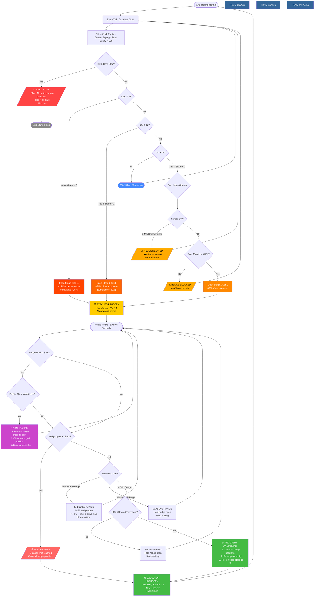

# GridBot-Guardian v3.13 — User Guide

## Table of Contents

1. [Overview](#1-overview)
2. [How It Works](#2-how-it-works)
3. [Installation & Setup](#3-installation--setup)
4. [Input Parameters Reference](#4-input-parameters-reference)
5. [Staggered Hedging System](#5-staggered-hedging-system)
6. [Cannibalism (Loss Shifting)](#6-cannibalism-loss-shifting)
7. [Unwind & Recovery Logic](#7-unwind--recovery-logic)
8. [Risk Auto-Scaling](#8-risk-auto-scaling)
9. [Hard Stop (Fail-Safe)](#9-hard-stop-fail-safe)
10. [Dashboard](#10-dashboard)
11. [State Persistence & Recovery](#11-state-persistence--recovery)
12. [Inter-Bot Communication](#12-inter-bot-communication)
13. [Alerts & Notifications](#13-alerts--notifications)
14. [Troubleshooting](#14-troubleshooting)
15. [FAQ — How the Hedging System Works](#15-faq--how-the-hedging-system-works) *(includes Mermaid flowchart)*
16. [Configuration Examples](#16-configuration-examples)

---

## 1. Overview

**GridBot-Guardian** ("The General") is the macro-defense and cannibalism engine of the 3-bot GridBot trading system. It does **not** trade the grid — its sole purpose is to **protect your account** when the grid enters deep drawdown.

**Key responsibilities:**
- Monitor account equity and detect drawdown (DD%)
- Place SELL (short) hedge positions in 3 stages to offset grid losses
- "Cannibalize" hedge profits to close the worst-performing grid positions
- Automatically unwind hedges when the market recovers
- Execute a hard stop (close everything) if DD exceeds the fail-safe threshold
- Freeze GridBot-Executor while hedging is active (prevents new grid entries)

**What Guardian does NOT do:**
- It does not place grid orders
- It does not manage take-profits or pending orders
- It does not modify GridBot-Executor's parameters

**Required companion bots:**
- **GridBot-Executor** — the live grid engine (must be running first)
- **GridBot-Planner** — optional HUD/optimization tool

---

## 2. How It Works

### Lifecycle

```
1. OnInit: Auto-detect SmartGrid → Load saved state → Verify connection
2. OnTick (every tick):
   a. Check grid health (heartbeat monitor)
   b. Track peak equity, calculate current DD%
   c. If DD >= Hard Stop → ExecuteHardStop() → close everything
   d. If DD >= Trigger → ExecuteHedge() → place/increase SELL hedge
   e. Every N seconds (full check):
      - Publish HEDGE_ACTIVE flag (freezes Executor)
      - If hedge active: manage unwind, cannibalism, duration check
3. OnDeinit: Save state → Clear HEDGE_ACTIVE flag → Cleanup dashboard
```

### Decision Flow

```
DD < T1 (30%)  →  STANDBY (monitoring only)
DD >= T1 (30%) →  STAGE 1: Open SELL hedge at 30% of grid volume
DD >= T2 (35%) →  STAGE 2: Add SELL hedge, total ~60% of grid volume
DD >= T3 (40%) →  STAGE 3: Add SELL hedge, total ~95% of grid volume
DD >= Hard (45%) → HARD STOP: Close ALL positions (grid + hedge)
DD < Safe (20%) + price in range → UNWIND: Close hedge, reset
```

---

## 3. Installation & Setup

### Prerequisites
- MetaTrader 5 with a **hedging** account (Exness, FXPro, etc.)
- GridBot-Executor must be running and publishing GlobalVariables
- AutoTrading must be enabled in MT5 terminal

### Steps
1. Copy `GridBot-Guardian_v3.1_Integrated.mq5` to `MQL5/Experts/`
2. Compile in MetaEditor (zero errors expected)
3. Start GridBot-Executor first — it publishes the GVs that Guardian auto-detects
4. Attach Guardian to the **same chart/symbol** as Executor
5. Verify the Experts log shows: `SMARTGRID DETECTED` and `GRID CONNECTION VERIFIED`

### Critical: Account Type
Guardian places SELL orders to hedge the grid's BUY positions. This requires a **hedging account**. On netting accounts, a SELL would close existing BUY positions instead of opening a separate hedge.

---

## 4. Input Parameters Reference

### Group 1: Auto-Detection & Linking

| Parameter | Default | Description |
|---|---|---|
| `InpAutoDetectGrid` | `true` | Automatically scan GlobalVariables for a running SmartGrid instance. **Recommended: true.** |
| `InpManualGridMagic` | `0` | If auto-detect is off, specify the Executor's magic number here. Set to 0 for auto-detect. |
| `InpHedgeMagic` | `999999` | Unique magic number for Guardian's own hedge positions. Must differ from Executor's magic. |

**How auto-detection works:** Guardian scans all MT5 GlobalVariables for a key matching `*_SG_LOWER`. It extracts the magic number prefix (e.g., `205001`) and constructs the GV namespace `205001_SG_*`. If the Executor isn't running yet, Guardian init will fail.

### Group 2: Trigger Logic (Staggered Hedging)

| Parameter | Default | Description |
|---|---|---|
| `InpHedgeTrigger1` | `30.0` | Stage 1 trigger: DD% at which the first hedge is placed |
| `InpHedgeRatio1` | `0.30` | Stage 1 hedge size: 30% of grid's net long exposure |
| `InpHedgeTrigger2` | `35.0` | Stage 2 trigger: DD% for second hedge layer |
| `InpHedgeRatio2` | `0.30` | Stage 2 additional size: +30% (cumulative ~60%) |
| `InpHedgeTrigger3` | `40.0` | Stage 3 trigger: DD% for third and final hedge layer |
| `InpHedgeRatio3` | `0.35` | Stage 3 additional size: +35% (cumulative ~95%) |
| `InpHardStopDD` | `45.0` | **HARD STOP**: Close ALL positions (both grid and hedge) at this DD% |

**Why 95% and not 100%?** The 5% net long "leak" is intentional — it allows cannibalism to work. If the hedge were 100%, the account would be flat and hedge profits would equal zero, making loss shifting impossible. The 5% residual also provides recovery potential if the market reverses.

**Trigger ordering rule:** T1 < T2 < T3 < Hard Stop. Guardian validates this on init and rejects invalid configurations.

### Group 3: Cannibalism (Loss Shifting)

| Parameter | Default | Description |
|---|---|---|
| `InpEnablePruning` | `true` | Enable killing the worst grid trade using hedge profits |
| `InpPruneThreshold` | `100.0` | Minimum hedge profit ($) before cannibalism is considered |
| `InpPruneBuffer` | `20.0` | Extra buffer ($) — hedge profit must exceed `worst_loss + buffer` |

### Group 4: Unwind & Recovery

| Parameter | Default | Description |
|---|---|---|
| `InpManualLowerPrice` | `0.0` | Fallback grid bottom if GV fails (normally auto-read from Executor) |
| `InpManualUpperPrice` | `0.0` | Fallback grid top if GV fails |
| `InpSafeUnwindDD` | `20.0` | Only close the hedge if DD drops below this % AND price is back in range |

### Group 5: Safety & Limits

| Parameter | Default | Description |
|---|---|---|
| `InpMinFreeMarginPct` | `150.0` | Require 150% of needed margin before placing a hedge. Prevents over-leveraging. |
| `InpMaxSpreadPoints` | `500` | Maximum spread (points) before hedge placement is delayed. Set to 3000+ for BTC/crypto. Set to 0 to disable. |
| `InpMaxHedgeDurationHrs` | `72` | Force-close the hedge after 72 hours regardless of DD. Protects against swap accumulation. |
| `InpEnableStateRecovery` | `true` | Persist hedge state via GlobalVariables. Survives MT5/VPS restarts. |

### Group 6: Performance

| Parameter | Default | Description |
|---|---|---|
| `InpFullCheckInterval` | `5` | Seconds between full system scans (unwind, cannibalism, duration checks) |
| `InpEnableDetailedLog` | `true` | Print detailed logs for debugging (risk scaling, exposure balance, etc.) |

### Group 7: Risk Auto-Scaling

| Parameter | Default | Description |
|---|---|---|
| `InpAutoScaleToRisk` | `true` | Scale hedge triggers proportionally to the Planner's published `MAX_RISK_PCT` |

When enabled, if Planner publishes `MAX_RISK_PCT=15%`, Guardian recalculates all triggers proportionally so that the hard stop aligns with 15% instead of 45%. See [Section 8](#8-risk-auto-scaling) for details.

### Group 8: Integration & Notifications

| Parameter | Default | Description |
|---|---|---|
| `InpGridHealthCheckInterval` | `10` | Seconds between heartbeat checks on Executor |
| `InpEnableAutoRebalance` | `false` | (Experimental) Auto-rebalance hedge when grid expands |
| `InpEnablePushNotify` | `true` | Send MT5 mobile push notifications for critical events |
| `InpEnableEmailNotify` | `false` | Send email notifications for critical events |

---

## 5. Staggered Hedging System

### Why Staggered?

A single large hedge at one DD level is risky — if the market reverses right after hedging, you've locked in a large short at a bad price. Staggered entry spreads the hedge across 3 stages:

| Stage | Default DD Trigger | Hedge Ratio | Cumulative Volume |
|---|---|---|---|
| Stage 1 | 30% | 30% of grid | 30% |
| Stage 2 | 35% | +30% of grid | ~60% |
| Stage 3 | 40% | +35% of grid | ~95% |

### Volume Calculation

Guardian reads the grid's `NET_EXPOSURE` from GlobalVariables (or calculates it directly from open positions). At each stage:

```
Target Volume = Grid Net Exposure × Cumulative Ratio
Volume to Add = Target Volume - Current Hedge Volume
```

Each stage gets its own ticket stored in `g_HedgeTickets[0..2]`.

### Hedge Execution Details

- **Order type:** Market SELL (instant execution)
- **Filling mode:** Auto-detected (FOK, IOC, or RETURN) based on broker
- **Slippage tolerance:** 100 points (configured for 150ms VPS latency)
- **Magic number:** 999999 (default) — separate from Executor's 205001
- **Comment:** `Guardian_Stage_1`, `Guardian_Stage_2`, `Guardian_Stage_3`

### Margin Check

Before placing each hedge, Guardian verifies:
```
Free Margin >= Required Margin × (InpMinFreeMarginPct / 100)
```
If margin is insufficient, the hedge is blocked and an alert is sent.

---

## 6. Cannibalism (Loss Shifting)

### Concept

When the hedge is profitable (market is falling, SELL position gains), Guardian uses that profit to "kill" the worst-performing grid position (biggest unrealized loss).

### Process

1. Calculate total hedge P/L across all 3 stage tickets
2. If `Hedge P/L < InpPruneThreshold ($100)` → skip
3. Find the worst grid position (largest loss, belongs to Executor's magic)
4. Skip positions being dredged by Executor's bucket system
5. Check: `Hedge P/L - InpPruneBuffer ($20) > |Worst Loss|`
6. If yes:
   a. Partially close the hedge (reduce volume to match new grid exposure)
   b. Close the worst grid position
7. Log the event and send alert

### Why It Matters

Cannibalism shifts losses from "unrealized and stuck" grid positions into "realized and cleared" — reducing the position count and freeing capital. Over multiple cycles, this effectively shrinks the grid's deep-water exposure.

### Interaction with Executor's Bucket/Dredge

Guardian checks `DREDGE_TARGET` GV to avoid killing a position that Executor is already dredging. Only one system should close any given position.

---

## 7. Unwind & Recovery Logic

### Recovery Conditions

For Guardian to close the hedge (unwind):

1. **DD must be below `InpSafeUnwindDD` (20%)** — the account has recovered
2. **Price must be back in range** — between grid's Lower and Upper bounds

Both conditions must be true simultaneously.

### Below-Range Behavior

If price is below the grid's Lower bound (market still falling):
- Guardian **holds the hedge open** — no broker SL, no trailing stop
- The hedge is a protective shield, not a profit-taking trade — a real $48k loss incident occurred when a broker SL was used on a hedge position, so all broker-side stops have been permanently removed
- It stays alive until one of the 4 managed exit paths resolves it (see below)

### Exit Paths (No Broker SL — Managed Exits Only)

The hedge **never** has a broker stop-loss or trailing stop. It exits only through these 4 paths:

1. **SafeUnwind** — DD recovered below threshold AND price is back in grid range
2. **Cannibalism** — hedge profit used to close worst grid positions (partial close)
3. **Duration limit** — force-close after `InpMaxHedgeDurationHrs` (72 hours)
4. **Hard Stop** — emergency close-all at DD >= `InpHardStopDD`

### Duration Limit

If the hedge has been open for `InpMaxHedgeDurationHrs` (72 hours), Guardian force-closes it regardless of DD. This prevents excessive swap accumulation (holding short positions incurs swap costs on most brokers).

---

## 8. Risk Auto-Scaling

### The Problem

By default, Guardian's triggers are absolute: 30%/35%/40%/45%. But if the Planner's `InpMaxRiskPerc` is set to 15%, a 45% hard stop makes no sense — the grid should never reach 45% DD with a 15% risk cap.

### The Solution

When `InpAutoScaleToRisk = true`, Guardian reads `MAX_RISK_PCT` from GlobalVariables (published by Planner via `PushToLive()`). It scales all triggers proportionally:

```
Scale Factor = MAX_RISK_PCT / InpHardStopDD

Effective T1 = InpHedgeTrigger1 × Scale
Effective T2 = InpHedgeTrigger2 × Scale
Effective T3 = InpHedgeTrigger3 × Scale
Effective Hard Stop = MAX_RISK_PCT
Effective Safe Unwind = InpSafeUnwindDD × Scale
```

### Example

| | Manual Setting | Scaled (MaxRisk=15%) |
|---|---|---|
| T1 | 30% | 10.0% |
| T2 | 35% | 11.7% |
| T3 | 40% | 13.3% |
| Hard Stop | 45% | 15.0% |
| Safe Unwind | 20% | 6.7% |

### Fallback

If Planner hasn't published `MAX_RISK_PCT` (GV doesn't exist), Guardian falls back to the manual input values. Scaling is refreshed periodically during `CheckGridHealth()`.

---

## 9. Hard Stop (Fail-Safe)

The **hard stop** is the nuclear option. When DD reaches `g_EffHardStop` (default 45%, or scaled):

1. **All positions are closed** — both grid (Executor's magic) and hedge (Guardian's magic)
2. State is cleared (hedge tickets, peak equity, stage)
3. `HEDGE_ACTIVE` flag is set to 0 (unfreezes Executor)
4. Alert is sent with total loss amount
5. Peak equity resets to current balance

**This is irreversible.** After a hard stop, the grid starts fresh. The hard stop exists to prevent catastrophic account blowout.

### When Does Hard Stop Fire?

```
Current DD = (Peak Equity - Current Equity) / Peak Equity × 100
If Current DD >= Effective Hard Stop → ExecuteHardStop()
```

This is checked **every single tick** (not on the timer) for maximum responsiveness.

---

## 10. Dashboard

Guardian displays a real-time chart panel in the top-left corner:

```
  GRIDBOT-GUARDIAN v3.1
  Linked: SmartGrid #205001
  ______________________________________
  Equity: $9,850.00
  Peak:   $10,000.00
  Drawdown: 1.50%
  ______________________________________
  T1: 30.0%  |  T2: 35.0%  |  T3: 40.0%
  ______________________________________
  STANDBY  (Monitoring)
  Next Trigger: 30.0% DD
  ______________________________________
  Cannibalized: $0.00
```

### Color Coding

| Element | Color | Meaning |
|---|---|---|
| DD text | Green | DD < T1, safe |
| DD text | Yellow | DD >= T1, Stage 1 |
| DD text | OrangeRed | DD >= T2, Stage 2 |
| DD text | Red | DD >= T3, Stage 3 |
| Hedge Status | Green (STANDBY) | No hedge active |
| Hedge Status | Red (HEDGE ACTIVE) | Hedge is live |
| Hedge P/L | Green/OrangeRed | Positive/negative hedge result |
| Cannibalized | Aqua | Total $ shifted via cannibalism |

### When Hedging

The dashboard expands to show:
- Hedge stage (1/3, 2/3, or 3/3)
- Total hedge volume (lots)
- Hedge P/L ($)
- Individual stage ticket numbers (S1: #12345, S2: #12346, S3: #12347)
- **Next escalation trigger** — shows the DD% that would activate the next hedge stage (e.g., "Next: Stage 2 @ 35.0% DD")

---

## 11. State Persistence & Recovery

Guardian saves its state to MT5 GlobalVariables every 60 seconds (and on critical events):

| GV Key | Data |
|---|---|
| `999999_GH_PEAK_EQUITY` | Peak equity value |
| `999999_GH_ACTIVE` | Whether hedge is active (1.0/0.0) |
| `999999_GH_TICKET_1/2/3` | Stage 1/2/3 hedge ticket numbers |
| `999999_GH_START_TIME` | When the hedge was opened |
| `999999_GH_OPEN_VOL` | Total hedge volume at open |
| `999999_GH_OPEN_PRICE` | Hedge open price |
| `999999_GH_STAGE` | Current stage (0-3) |
| `999999_GH_GRID_MAGIC` | Detected grid magic number |
| `999999_GH_LAST_UPDATE` | Timestamp of last state save |

### On Restart

1. Guardian loads saved state from GVs
2. If state is older than 24 hours → discarded as stale
3. If state says hedge is active → verifies the tickets still exist as live positions
4. If tickets are gone → resets hedge state
5. If tickets exist → resumes management (cannibalism, unwind monitoring, etc.)

### Clearing State

State is automatically cleared on hard stop. To manually reset, remove Guardian from the chart and delete the `999999_GH_*` GlobalVariables from MT5's Tools → Global Variables window.

---

## 12. Inter-Bot Communication

All communication uses MT5 GlobalVariables (no files, no network).

### Guardian Reads (from Executor)

| GV Key | Purpose |
|---|---|
| `205001_SG_LOWER` | Grid bottom price |
| `205001_SG_UPPER` | Grid top price |
| `205001_SG_LEVELS` | Number of grid levels |
| `205001_SG_NET_EXPOSURE` | Grid's net long volume |
| `205001_SG_HEARTBEAT` | Executor's last tick timestamp |
| `205001_SG_LAST_UPDATE` | Executor's last state save |
| `205001_SG_DREDGE_TARGET` | Ticket being dredged (don't cannibalize) |
| `205001_SG_MAX_RISK_PCT` | Planner's max risk % (for auto-scaling) |

### Guardian Writes

| GV Key | Purpose |
|---|---|
| `205001_SG_HEDGE_ACTIVE` | 1.0 when hedging, 0.0 when not (freezes Executor) |
| `999999_GH_HEARTBEAT_TS` | Guardian's own heartbeat |
| `999999_GH_*` | All state persistence keys |

### Freeze Protocol

When Guardian sets `HEDGE_ACTIVE = 1.0`:
- Executor reads this every `InpCoordinationCheckInterval` (5s)
- Executor detects HEDGE_ACTIVE=1 and returns early (stops placing new orders)
- Existing grid positions remain open (they're the hedge target)
- When Guardian unwinds and sets `HEDGE_ACTIVE = 0.0`, Executor resumes

---

## 13. Alerts & Notifications

Guardian sends alerts via three channels:

| Channel | Controlled By | When |
|---|---|---|
| MT5 Alert popup | Always active | All critical events |
| Mobile Push | `InpEnablePushNotify` | Hedge placed/removed, cannibalism, hard stop |
| Email | `InpEnableEmailNotify` | Same as push |

### Critical Alert Messages

| Alert | Meaning |
|---|---|
| `CRITICAL: Grid Bot FROZEN!` | Executor heartbeat stale >60 seconds (throttled to once per 5 minutes) |
| `HEDGE INCREASED (Stage N)` | New hedge stage placed |
| `HEDGE BLOCKED: Insufficient margin!` | Not enough margin for hedge |
| `CANNIBALISM: Killed trade #XXXXX` | Grid position closed with hedge profits |
| `HEDGE UNWOUND @ XXXX.XX` | Hedge closed successfully, DD recovered |
| `HEDGE CLOSED: Time limit (Xhrs)` | 72-hour duration limit reached |
| `CRITICAL: HARD STOP TRIGGERED!` | All positions closed, fail-safe activated |

---

## 14. Troubleshooting

### "INIT FAILED: Cannot find SmartGrid"

**Cause:** Executor is not running or hasn't published its GVs yet.
**Fix:** Start GridBot-Executor first, wait for it to publish GVs, then attach Guardian.

### "HEDGE BLOCKED: Insufficient Margin"

**Cause:** Free margin is less than 150% of hedge margin requirement.
**Fix:** Deposit more funds, reduce grid size, or lower `InpMinFreeMarginPct`.

### Hedge Not Triggering

**Check:**
1. Is `InpAutoScaleToRisk = true`? Effective triggers may be much lower than displayed inputs.
2. Check the Experts log for `RISK SCALE:` — it shows the effective trigger values.
3. Verify DD calculation: `DD = (Peak - Current) / Peak × 100`. Peak equity only moves up, never down.
4. Check for `HEDGE DELAYED: Extreme spread` in Experts log — spread may exceed `InpMaxSpreadPoints`. For BTC/crypto, set this to 3000+.
5. Check for `HEDGE BLOCKED: Insufficient Margin` — free margin must be ≥ 150% of hedge margin requirement.

### Cannibalism Not Working

**Check:**
1. Is `InpEnablePruning = true`?
2. Is hedge P/L > `InpPruneThreshold` ($100)?
3. Is the worst grid loss < hedge P/L - buffer?
4. Is the worst position being dredged by Executor? (check `DREDGE_TARGET` GV)

### "SmartGrid FROZEN" Alert (Heartbeat Warning)

**Cause:** Executor hasn't updated its heartbeat GV in >60 seconds AND LAST_UPDATE is also stale (both must be stale to trigger — prevents false alerts during normal operation).
**Note:** This alert is throttled to once per 5 minutes to avoid log spam.
**Possible reasons:**
- Executor crashed or was removed
- MT5 terminal disconnected from broker
- VPS froze or ran out of memory
**Fix:** Check MT5 terminal, restart Executor if needed.

### Dashboard Not Showing

Guardian's dashboard uses chart objects (OBJ_LABEL). If it doesn't appear:
- Check that chart has room (zoom out)
- The panel is in the top-left corner (CORNER_LEFT_UPPER)
- If Executor's dashboard overlaps, they'll stack since both use the same corner

---

## 15. FAQ — How the Hedging System Works

### Q: How does Guardian decide when to hedge?

Guardian monitors **peak-to-equity drawdown** every tick:

```
DD% = (Peak Equity - Current Equity) / Peak Equity × 100
```

Peak equity is a high-water mark — it only moves up, never down. When DD% crosses a trigger threshold, the corresponding hedge stage opens.

| DD Threshold | Action | Hedge Size |
|---|---|---|
| **T1 (30%)** | Stage 1 SELL opened | 30% of grid net exposure |
| **T2 (35%)** | Stage 2 SELL added | +30% (cumulative 60%) |
| **T3 (40%)** | Stage 3 SELL added | +35% (cumulative 95%) |
| **Hard Stop (45%)** | Close ALL positions | Grid + hedge liquidated |

> With **Risk Auto-Scaling ON**, all thresholds compress proportionally. Example: if `MAX_RISK_PCT = 25%`, then scale = 25/45 = 0.556, so T1 = 16.7%, T2 = 19.4%, T3 = 22.2%.

### Q: How is hedge volume calculated?

```
Target Volume = Grid Net Exposure × Cumulative Ratio at current stage
Volume to Add = Target Volume - Current Hedge Volume
```

**Example:** Grid has 17.40 lots net long, Stage 1 triggers:
- Target = 17.40 × 0.30 = 5.22 lots SELL
- Guardian opens a 5.22 lot SELL position with magic 999999

Each stage gets its own position stored in a separate ticket slot (`g_HedgeTickets[0..2]`).

### Q: What checks happen before a hedge is placed?

Four pre-conditions must all pass:

| Check | Condition | What Happens If Failed |
|---|---|---|
| **Grid link** | Executor detected and publishing GVs | `Cannot hedge: SmartGrid not detected` |
| **Net exposure** | Grid has net long positions (> 0) | `Net exposure is zero/short — No hedge needed` |
| **Spread** | Spread < `InpMaxSpreadPoints` | `HEDGE DELAYED: Extreme spread — waiting` |
| **Margin** | Free margin ≥ 150% of hedge margin | `HEDGE BLOCKED: Insufficient Margin` |

> **Important for BTC/crypto:** The default `InpMaxSpreadPoints = 500` is tuned for Gold. BTC typically has 1500-2000 point spreads. Set this to 3000+ for crypto symbols, or set to 0 to disable the spread check entirely.

### Q: Do hedge stages ever de-escalate?

**No.** Stages only move upward: 0 → 1 → 2 → 3. Once Stage 1 is active, Guardian will never drop back to Stage 0 while the hedge is open. The hedge can only be removed through **unwinding** (recovery) or **hard stop** (emergency).

### Q: When does the hedge close (unwind)?

**Two conditions must BOTH be true simultaneously:**

1. **Price is back inside the grid range** (Lower ≤ Price ≤ Upper)
2. **DD has dropped below the unwind threshold** (`InpSafeUnwindDD`, default 20%)

When both conditions are met, Guardian closes all hedge positions, resets peak equity, sets `HEDGE_ACTIVE = 0`, and the Executor resumes normal operation.

> With Risk Auto-Scaling, unwind threshold is also scaled. Example: 20% × 0.556 = 11.1%.

### Q: What happens if price is still below the grid while hedged?

Guardian **holds the hedge open** with no stop-loss and no trailing stop. The hedge is a protective shield — its job is to stay alive as long as the drawdown threat exists. It is never killed by a broker SL (a real $48k loss occurred when broker SL was used on a hedge — this is why all broker-side stops were permanently removed). The hedge exits only through one of the 4 managed paths: SafeUnwind recovery, Cannibalism, Duration limit (72hr), or Hard Stop.

### Q: What is cannibalism and how does it work?

**Cannibalism (loss shifting)** uses hedge profits to close the worst-performing grid position. The process:

1. Hedge must have at least `$100` profit (`InpPruneThreshold`)
2. Guardian finds the grid position with the largest unrealized loss
3. Checks: `Hedge Profit - $20 buffer ≥ |Worst Loss|`
4. If yes → partially close the hedge (rebalance to new net exposure ratio) → close the bad grid position
5. Net effect: the loss is realized, the position is freed, and grid exposure shrinks

**Example:**
- Hedge profit: $500
- Worst grid position: -$350 loss
- Budget: $500 - $20 = $480 > $350 → **Proceed**
- Hedge is reduced proportionally, worst position is closed

Cannibalism only fires when enabled (`InpEnablePruning = true`) and skips any position already being dredged by the Executor's bucket system.

### Q: What happens when the hard stop fires?

At DD ≥ `g_EffHardStop` (default 45%, or scaled):

1. **All positions closed** — both grid (Executor magic) and hedge (Guardian magic)
2. Retries up to 3 times with 200ms delays if any close fails
3. All hedge state cleared (tickets, stage, peak equity)
4. `HEDGE_ACTIVE = 0` → Executor unfreezes
5. Peak equity resets to current balance (prevents immediate re-triggering)
6. Alert sent with total loss amount

**This is irreversible.** The grid starts completely fresh after a hard stop.

### Q: How does the freeze protocol work?

```
Guardian opens hedge → sets HEDGE_ACTIVE = 1.0 (GlobalVariable)
                              ↓
Executor reads HEDGE_ACTIVE every 5 seconds
                              ↓
Executor enters FROZEN state:
  ✗ No new BUY LIMIT orders placed
  ✗ No dynamic grid shifts
  ✗ No dredging
  ✓ Existing positions remain open
  ✓ Virtual TP closes still fire (positions can close for profit)
  ✓ Heartbeat keeps updating (so Guardian knows Executor is alive)
  ✓ Peak equity still tracked
                              ↓
Guardian unwinds hedge → sets HEDGE_ACTIVE = 0.0
                              ↓
Executor resumes normal operation
```

### Q: What is the complete hedging lifecycle?

```
Normal Grid Trading
        ↓
DD hits T1 ────────→ Stage 1 SELL opened (30% of exposure)
        ↓                    ↓
Executor FROZEN         Cannibalism fires if hedge profitable
        ↓                    ↓
DD hits T2? ───────→ Stage 2 SELL added (+30%, total 60%)
DD hits T3? ───────→ Stage 3 SELL added (+35%, total 95%)
DD hits Hard Stop? ─→ CLOSE EVERYTHING (nuclear option)
        ↓
Price recovers into grid range + DD < unwind threshold
        ↓
All hedge positions closed
        ↓
Executor unfrozen → Grid resumes normal trading
```

### Q: Why is the max hedge 95% and not 100%?

The 5% net long "leak" is intentional. If the hedge were 100%, the account would be flat — hedge profits would equal zero, making cannibalism impossible. The 5% residual also preserves recovery potential if the market reverses.

### Flowchart: Complete Hedging & Unwinding Process



**Reading the flowchart:**
- **Blue** = Normal/standby state
- **Orange/Yellow** = Hedge opening and freeze
- **Purple** = Cannibalism (loss shifting)
- **Steel blue** = Holding states (hedge open, waiting for conditions)
- **Green** = Recovery and unwind
- **Red** = Hard stop (emergency)

**Key decision points:**
1. **Entry:** DD crosses T1/T2/T3 thresholds (after spread + margin checks pass)
2. **During hedge:** Cannibalism fires when profitable enough; hedge held open with no SL
3. **Exit:** Price returns to grid range AND DD drops below unwind threshold — OR 72-hour duration limit — OR hard stop

---

## 16. Configuration Examples

### Conservative (Small Account, Low Risk)

```
InpHedgeTrigger1 = 15.0    // Start hedging early
InpHedgeTrigger2 = 20.0
InpHedgeTrigger3 = 25.0
InpHardStopDD    = 30.0    // Tighter fail-safe
InpPruneThreshold = 50.0   // Cannibalize sooner
InpSafeUnwindDD  = 10.0    // Unwind earlier
InpMaxHedgeDurationHrs = 48 // Shorter swap exposure
```

### Aggressive (Large Account, High Risk Tolerance)

```
InpHedgeTrigger1 = 35.0    // Give grid more room
InpHedgeTrigger2 = 40.0
InpHedgeTrigger3 = 45.0
InpHardStopDD    = 50.0    // Wider fail-safe
InpPruneThreshold = 200.0  // Only cannibalize large profits
InpSafeUnwindDD  = 25.0    // Wait for deeper recovery
InpMaxHedgeDurationHrs = 120 // Accept more swap cost
```

### With Risk Auto-Scaling (Recommended)

```
InpAutoScaleToRisk = true   // Let Planner control triggers
InpHedgeTrigger1 = 30.0    // These become the "reference ratios"
InpHedgeTrigger2 = 35.0    // Actual values auto-calculated
InpHedgeTrigger3 = 40.0    // from Planner's MaxRiskPerc
InpHardStopDD    = 45.0
```

If Planner publishes `MaxRiskPerc = 25%`, effective triggers become: T1=16.7%, T2=19.4%, T3=22.2%, Hard=25.0%.

---

*Generated for GridBot-Guardian v3.13 Integrated Edition. Last updated: 2026-02-28.*
